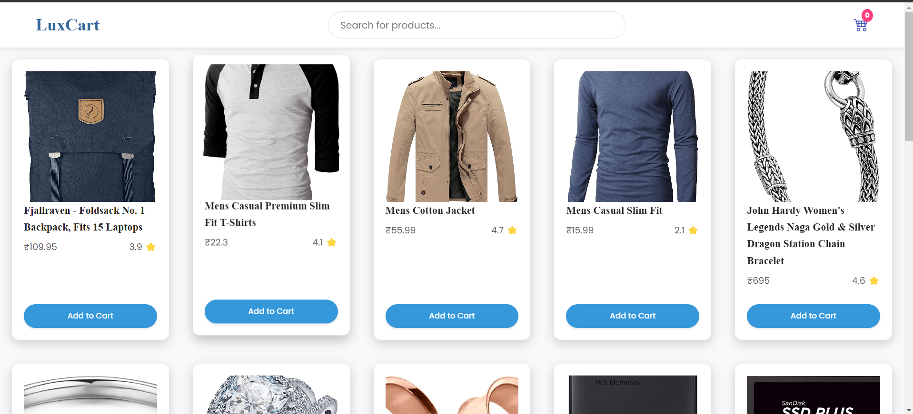

# LuxCart E-commerce Application

LuxCart is a basic e-commerce application built with HTML, CSS, and JavaScript. It fetches product data from a dummy API (Fake Store API), displays it to the user, provides a shopping cart, and basic search functionality.

## DeployMent
Website is deployed on vercel
### link: https://lux-cart-ntve5oyuc-supsens-projects.vercel.app/

## Key Features
### Product Listing:
    Fetches and dynamically renders a list of products with their image, name, price, and ratings.

    Search Bar: 
    Enables users to find products based on keywords.

### Shopping Cart:

    Users can add products to their cart.

    View and manage their cart's contents.

    See the total price.

## User Experience
### Skeleton Loader: Provides visual feedback while product data is being loaded.
.png>)

### Empty State Handling: Displays messages for "Empty Cart" and "No Products Found."

### Responsive Design: Offers a decent viewing experience across different screen sizes (desktops, tablets, mobile).

## Installation and Setup
Clone the Repository:

git clone https://github.com/your-username/luxcart.git  
cd luxcart
Use code with caution.
Bash
(Replace your-username with your actual GitHub username).

No External Dependencies:

LuxCart only uses vanilla HTML, CSS, and JavaScript, so no external packages are needed.

## User Journey

## Open in Browser:

Open index.html in your web browser to view the application. or the deploy link

Execution Process
Loading the Application:

Upon visiting index.html, skeleton loader placeholders are immediately displayed for a smooth visual experience:

Data Fetching:

The JavaScript code in script.js asynchronously fetches product data from the Fake Store API.

Dynamic Product Rendering:

The fetched data is then used to dynamically create and render product card elements, replacing the skeleton loaders:

User Interaction:

Searching:

Typing in the search bar filters the product list in real time. If no matching products are found, a "No products found." message is displayed.

Cart Management:

Users can add products to the cart, increase/decrease item quantity, remove items, and see the total price dynamically updated.

The cart section also shows an "Empty Cart" message if no items are present.

### Future Improvements
    Implement proper order processing logic and integration with a backend system.

    Add product filtering/sorting capabilities.

    Enhance the user interface and overall styling for a more polished look.

    Implement user authentication/accounts for a personalized experience.